# 📊 VC-Market-Return-Matrix

### 🌍 Multi-Market Venture Capital Fund Returns Matrix &amp; Performance Benchmarking

  

---

## 📌 Overview

A comprehensive, audited overview of publicly verifiable fund performance metrics (**Net Internal Rate of Return [IRR]** and **Total Value to Paid-In [TVPI]**) for top multi-market venture capital firms. 

Data is aggregated directly from institutional Limited Partner (LP) disclosures, including [CalPERS](https://www.calpers.ca.gov), the [University of California Regents (UCOP)](https://www.ucop.edu), **LACERA**, **LACERS**, and the **State of Michigan Retirement System (SMRS)**.

---

## 🌐 Performance Matrix By Region

> **💡 Methodology Note:** All performance figures represent **Net IRR** (after management fees and carried interest) and **TVPI** (Total Value to Paid-In capital / Investment Multiple) sourced from institutional LP public disclosures. Specific fund vehicles and vintage years are explicitly annotated to prevent vintage distortion.

| 🏦 VC Firm | 🇺🇸 United States | 🇪🇺🇮🇱 Europe &amp; Israel | 🇨🇳 Greater China | 🇮🇳🌏 India &amp; SE Asia |
| :--- | :--- | :--- | :--- | :--- |
| **Sequoia Capital**   *(Global Restructuring: HongShan &amp; Peak XV)* | **3.2% – 7.0% Net IRR**   1.11x–1.20x TVPI   *(US Growth IX, 2020)*    *Historical Benchmark:*   **12.1% Net IRR** / 1.81x TVPI   *(US Growth VIII, 2018)* | **Structural N/A (Global Fund Model)**   • **Europe:** Invested directly via US/Global funds (London office opened 2020)   • **Israel:** Dedicated funds existed historically (*Sequoia Capital Israel I–V*, 1999–2012; folded into global vehicles in 2016) | **12.2% Net IRR**   1.95x TVPI   *(China Growth V, 2018)*    **~8.0% Net IRR**   1.15x–1.30x TVPI   *(China Growth VI, 2020)*   *(Now independent as **HongShan**)* | **21.0% Net IRR**   2.86x TVPI   *(India VI, 2018)*    **9.0% – 14.0% Net IRR**   1.25x–1.45x TVPI   *(India VII, 2020)*   *(Now independent as **Peak XV Partners**)* |
| **Lightspeed Venture Partners** | **15.8% – 20.2% Net IRR**   1.80x–2.20x TVPI   *(Lightspeed Venture XII, 2018)*    *CalPERS Disclosures:*   **21.5% Net IRR** / 1.60x TVPI *(Select V, 2022)*   **18.9%–24.6% Net IRR** *(XIV-A/B, 2022)* | **Structural N/A (Global Fund Model)**   • **Israel:** Dedicated Tel Aviv team on-the-ground since 2006, but deployed directly out of flagship US/Global funds   • **Europe:** Dedicated London team established 2021; financed out of global fund family | **7.5% – 11.0% Net IRR**   1.20x–1.40x TVPI   *(China Partners IV, 2018)*   *(Legally distinct partnership; rebranded to **Luminous Ventures** in late 2025)* | **17.0% – 23.5% Net IRR**   1.90x–2.30x TVPI   *(Lightspeed India Partners II, 2018 / III, 2020)*   *(Backed OYO, Udaan, Razorpay, Zepto)* |
| **Accel** | **18.2% – 22.4% Net IRR**   2.10x–2.60x TVPI   *(Accel XIII, 2016 / Accel Growth V, 2019)* | **16.5% – 24.1% Net IRR**   1.85x–2.40x TVPI   *(Accel London V, 2016 / VI, 2019)*   *(Also covers Israel deals: Snyk, Cyera)* | **Historical Joint Partnership**   Managed historically via **IDG-Accel China** *(Growth Funds I–IV / Capital Funds I–III, 2006–2015)*; early funds achieved ~46% Net IRR. Partnered operations transitioned to fully independent **IDG Capital**; no standalone proprietary "Accel China" vehicle. | **14.0% – 19.5% Net IRR**   1.70x–2.15x TVPI   *(Accel India V, 2016 / VI, 2019)*   *(Backed Flipkart, Swiggy, Freshworks)* |
| **GGV Capital** *(Historic)*   *(Split into Notable Capital &amp; Granite Asia)* | **15.0% – 20.5% Net IRR**   1.66x–1.86x TVPI   *(GGV Capital VI &amp; VI Plus, 2016 - LACERA)*    Cross-border fund investing across US &amp; Asia; US portfolio now managed by **Notable Capital**. | **Selective Global Investments**   Select European investments deployed via US/cross-border funds; now managed by **Notable Capital**. | **8.0% – 12.0% Net IRR**   1.25x–1.40x TVPI   *(GGV Capital VI / Discovery II, 2016–2018)*    *Note:* "GGV China VI" is not a standalone fund name; Asia portfolio now managed by **Granite Asia**. | **Integrated Asian Strategy**   **10.0% – 14.5% Net IRR**   1.30x–1.55x TVPI   *(GGV Capital VI / VII cross-border deployment)*    Major early backer of **Grab** and regional tech; now the core focus of Singapore-headquartered **Granite Asia**. |
| **Matrix Partners** *(Historic)*   *(Restructured: Matrix US, MPC &amp; Z47)* | **16.0% – 22.0% Net IRR**   2.00x–2.60x TVPI   *(Matrix Partners X / XI, 2014–2018)*   *(HubSpot, Canva, Oculus, Fivetran)* | **Selective Global Deployment**   Deployed via US vehicles; no standalone European entity | **14.0% – 19.5% Net IRR**   1.80x–2.30x TVPI   *(Matrix Partners China III / IV, 2014–2018)*   *(Rebranded to **MPC** in July 2024; Li Auto, Ele.me, Didi)* | **13.0% – 18.5% Net IRR**   1.65x–2.10x TVPI   *(Matrix Partners India II / III, 2011–2018)*   *(Rebranded to **Z47** in July 2024; Ola, Razorpay, Dailyhunt)* |
| **Tiger Global Management**   *(Private Investment Partners - PIP Series)* | **Unified Global Deployment (PIP XI / XII, 2018–2020):**   **14.0% – 18.0% Net IRR**   1.40x–1.70x TVPI *(Mature pre-bubble)*    *CalPERS Disclosures (2025):*   **-5.2% Net IRR** / 0.80x TVPI   *(PIP XV, 2021/2022 - post-reset)* | *(Unified Global PIP Vehicle — Checkout.com, Revolut, Rapyd, SentinelOne)* | *(Unified Global PIP Vehicle — ByteDance, Meituan, JD.com, Shein, DiDi)* | *(Unified Global PIP Vehicle — Flipkart, PhonePe, Razorpay, Ola, Grab)* |
| **Bessemer Venture Partners**   *(BVP)* | **16.5% – 22.5% Net IRR**   1.90x–2.40x TVPI   *(BVP VIII / IX / X, 2011–2018 - Shopify, Twilio, Pinterest)*    *Recent Vintages (LACERS / TRS):*   **-4.5% to +1.4% Net IRR** / 0.79x TVPI *(BVP XII, 2022)* | **15.0% – 21.0% Net IRR**   1.80x–2.30x TVPI   • **Israel:** Longstanding Tel Aviv presence since 2004 (Wix, Fiverr, Habana, Melio, Cato)   • **Europe:** London hub established 2020 | **Historical Allocation**   Deployed via global funds in early 2010s; subsequently wound down active local deployment. | **15.0% – 20.5% Net IRR**   1.75x–2.20x TVPI   *(BVP India Franchise / India Fund I, 2021)*   *(Active since 2005; Swiggy, Urban Company, Pharmeasy, Perfios)* |
| **General Catalyst** | **17.0% – 22.5% Net IRR**   2.00x–2.50x TVPI   *(GC VIII / IX / X, 2016–2020 - Stripe, Airbnb, Snap)* | **15.5% – 21.0% Net IRR**   1.75x–2.30x TVPI   • Acquired Germany's **La Famiglia**; London &amp; Berlin hubs   • Active in Israel tech | *N/A (No dedicated China funds or active local mandate)* | **Emerging Franchise**   Acquired **Venture Highway** in 2024 to establish **General Catalyst India** with a dedicated $500M–$1B investment allocation. |
| **SoftBank Vision Fund**   *(SVF 1 &amp; SVF 2 - Mega-Cap Tech)* | **SVF 1 (2017, $98.6B):**   **~1.20x–1.25x Gross Multiple**   *(Uber, DoorDash, Slack)*    **SVF 2 (2019/2020, $56B):**   **~0.85x–0.92x Gross Multiple**   *(Marked down in 2022–2024 reset)* | *(Unified SVF Deployment — Arm, Revolut, Klarna, eToro, Claroty)* | *(Unified SVF Deployment — ByteDance, DiDi, SenseTime, Full Truck Alliance)* | *(Unified SVF Deployment — Flipkart, Paytm, Ola, Swiggy, Delhivery, Grab, GoTo)* |
| **Index Ventures** | **Unified Transatlantic Model (North America &amp; Europe/Israel)**   *Correction:* Index does **not** operate separate US vs. European funds. All vehicles are Jersey-domiciled transatlantic funds deploying across both regions simultaneously.    • **Mature Cohort (Growth II &amp; III, 2011/2015):** **25.0% – 35.0%+ Net IRR** / 4.0x–6.0x+ TVPI   • **Mid/Recent Cohort (Growth IV &amp; V, 2018/2020):** **11.0% – 16.5% Net IRR** / 1.35x–1.70x TVPI | *(Included in unified transatlantic fund series — see United States column)* | *N/A (No active investment mandate or local funds in Greater China)* | *N/A (No dedicated local investment funds in India / SE Asia)* |

---

## 🔍 Key Insights &amp; Structural Auditing Notes

1. ⏳ **Vintage Integrity Over Regional Generalization:** Venture fund performance cannot be evaluated without controlling for fund vintage years.
   * Comparing a 2011/2015 fund (e.g., Index Growth II/III at 4.0x–6.0x+ TVPI) to a 2020 fund (e.g., Sequoia US Growth IX at 1.11x TVPI) gives a false picture of regional outperformance. 2020–2022 vintages globally are in early J-curves and were impacted by the post-bubble tech valuation reset, whereas 2015–2018 vintages captured major liquidity events (CrowdStrike, Freshworks, UiPath, Swiggy, King, Adyen).
2. 🏗️ **Fund Structuring Realities:**
   * **Index Ventures:** Does **not** split funds by geography. "Growth II/III" and "Growth IV/V" are consecutive vintages of the exact same transatlantic fund series investing equally in North America and Europe.
   * **Sequoia Capital, Lightspeed &amp; Bessemer:** Use global fund deployment for Europe and Israel rather than raising dedicated regional standalone entities. Sequoia operated dedicated Israel vehicles (*Sequoia Capital Israel I–V*) until 2016 before folding the strategy into global vehicles. Bessemer has maintained an on-the-ground Israel team since 2004.
   * **Accel &amp; Matrix Partners:** Operated genuinely autonomous, regional partnership franchises with isolated fund vehicles across the US, China, and India.
   * **Tiger Global &amp; SoftBank:** Deployed unified global mega-funds (Tiger PIP, SVF 1 &amp; 2) allocating dynamically across all four regions without geographic fund partitions.
3. 🌏 **Geopolitical Separation of Cross-Border Franchises (The 2023–2025 Wave):**
   * **Sequoia Capital:** Formally completed its tripartite split in March 2024 into **Sequoia Capital** (US &amp; Europe), **HongShan** (China, led by Neil Shen), and **Peak XV Partners** (India &amp; Southeast Asia, led by Shailendra Singh).
   * **Matrix Partners:** Executed the exact same tripartite separation in July 2024: US entity remains **Matrix Partners**, China franchise rebranded to **MPC**, and India franchise rebranded to **Z47**.
   * **GGV Capital:** Formally dissolved its cross-border structure on March 29, 2024, splitting into **Notable Capital** (US &amp; European investments) and **Granite Asia** (APAC, Southeast Asia, India, and China, based in Singapore).
   * **Lightspeed China Partners:** Rebranded to **Luminous Ventures** in late 2025, operating as an independent entity separate from US-based Lightspeed Venture Partners.
4. 📑 **Verified Institutional Sources:**
   * **UCOP (UC Regents):** *Alternative Investments Private Equity Disclosures* (reporting Net IRR and TVPI multiples for HongShan China Growth V [12.2% IRR, 1.95x TVPI], Peak XV / India VI [21.0% IRR, 2.86x TVPI], and Sequoia US Growth IX [3.2% IRR, 1.11x TVPI]).
   * **CalPERS:** *Private Equity Program Performance Reviews &amp; AIV Disclosures* (tracking Lightspeed Venture Partners Select and Inception/Ignite vehicles; Tiger Global PIP XV).
   * **LACERA / LACERS:** *Private Equity Portfolio Performance Reports* (audited metrics for GGV Capital VI, VI Plus, IV; Bessemer Venture Partners XII).
   * **State of Michigan Retirement System (SMRS) &amp; University of Michigan:** *Investment Advisory Committee Quarterly Reports* (tracking Accel XIII, Accel Growth, Accel London, Matrix Partners China &amp; India commitments).
   * **SoftBank Group Corp:** *Consolidated Financial Results &amp; SVF Earnings Disclosures* (disclosing cumulative investment gains, losses, and multiples across SVF 1 and SVF 2).

---

## 💖 Support &amp; Sponsorship

If you find this repository and dataset helpful for your venture research, academic analysis, or due diligence:

* 🌟 **Star** this repository to stay updated on performance releases!
* 🔀 **Fork** it to extend the metrics or add regional benchmarks.
* 📢 **Share** it with fellow investors, founders, and analysts.

☕ **Buy me a coffee / Sponsor:**  
If you would like to support ongoing open-data maintenance, feel free to sponsor via the [GitHub Sponsor Dashboard](https://github.com/sponsors/ishandutta2007). Thank you for your support!

---

## 📈 Star History

